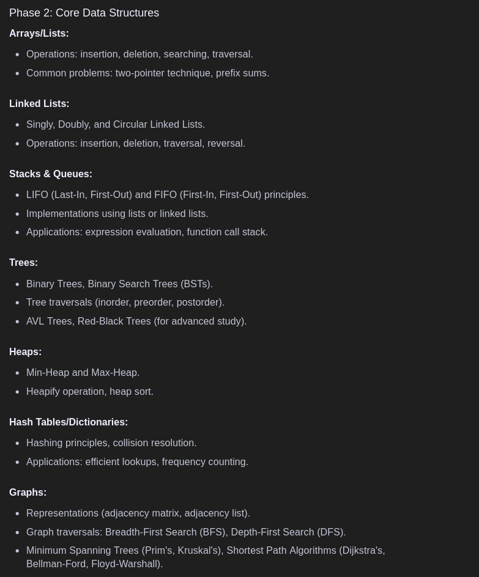

## Map-Dsa

- Click here for Fundamentals - [Python Fundamentals](https://www.w3schools.com/python/default.asp)
- Click Here - [OOPS](/OOPS.md)

- Time Complexity - [Time Complexity](/Time_complesity.md)
- Array (array lib for OG array)- [Array](/array.ipynb)

